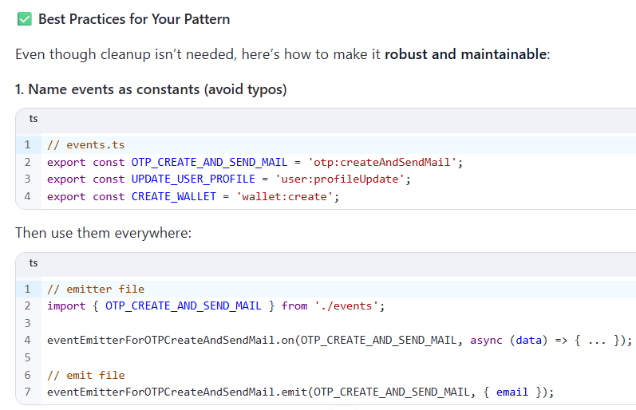

// In dev, you can check
console.log('OTP listeners:', eventEmitterForOTPCreateAndSendMail.listenerCount(OTP_CREATE_AND_SEND_MAIL));

// In your main server file
process.on('SIGTERM', () => {
  eventEmitterForOTPCreateAndSendMail.removeAllListeners();


🔁 Alternative: Use a Message Queue (for scale)
If your app grows, consider replacing EventEmitter with:

BullMQ (Redis-based queue)
RabbitMQ, Kafka, etc.
Why?

Survives process restarts
Retries on failure
Distributed across services
But for a single Node.js app, EventEmitter is perfectly fine.


Absolutely! Since you’re using Node.js clustering, we can make your eventEmitterForAuditLog work across all workers using Redis Pub/Sub. This way, any worker emitting the event will notify all other workers, and all will persist to the DB.

Here’s a full working example:

```ts

// redisEventBus.ts
import { createClient } from 'redis';
import EventEmitter from 'events';
import { auditLog } from './models/auditLog';
import { IauditLog, TStatus } from './types';

// Create a local event emitter for in-process events
export const eventEmitterForAuditLog = new EventEmitter();

// Redis clients for pub/sub
const pubClient = createClient({ url: process.env.REDIS_URL });
const subClient = pubClient.duplicate();

await pubClient.connect();
await subClient.connect();

// Redis channel for audit events
const CHANNEL = 'auditLogEvents';

// Subscribe to Redis channel
await subClient.subscribe(CHANNEL, (message: string) => {
  try {
    const data: IauditLog = JSON.parse(message);
    auditLog.create({
      userId: data.userId,
      role: data.role,
      actionPerformed: data.actionPerformed,
      status: data.status,
    });
  } catch (error) {
    console.error('Error processing audit log from Redis channel', error);
  }
});

// Whenever local event is emitted, also publish to Redis
eventEmitterForAuditLog.on('eventEmitForAuditLog', (data: IauditLog) => {
  // Persist locally
  try {
    auditLog.create({
      userId: data.userId,
      role: data.role,
      actionPerformed: data.actionPerformed,
      status: data.status,
    });
  } catch (error) {
    auditLog.create({
      userId: data.userId,
      role: data.role,
      actionPerformed:
        'Error occurred 🌋 while creating audit log :: ' + data.actionPerformed,
      status: TStatus.failed,
    });
  }

  // Publish to Redis so other workers can also log it
  pubClient.publish(CHANNEL, JSON.stringify(data));
});


```

```
✅ How it works:

Each worker has a local EventEmitter instance.

When a worker emits eventEmitForAuditLog, it:

Writes to DB locally.

Publishes the event to Redis.

All workers subscribe to the Redis channel:

They get every event, including those emitted by other workers.

Each worker writes to the DB.

This ensures your audit logging works across all cluster workers, and you don’t need Kafka if audit logs volume is reasonable.

If you want, I can also show a Kafka version that would scale even better for high-throughput logs. It’s almost identical but more robust.

```

```

Absolutely! Using Kafka instead of Redis Pub/Sub is a good choice if you expect high volume events, durability, or want event replay capabilities. Here’s a full example for your audit log across Node.js cluster workers.

1️⃣ Kafka Setup

Make sure you have a Kafka broker running and reachable. For local Docker setup, you already have:
```

```ts
// kafkaEventBus.ts
import { Kafka } from 'kafkajs';
import { auditLog } from './models/auditLog';
import { IauditLog, TStatus } from './types';
import EventEmitter from 'events';

// Local EventEmitter
export const eventEmitterForAuditLog = new EventEmitter();

// Kafka client
const kafka = new Kafka({
  clientId: 'suplify-backend',
  brokers: [process.env.KAFKA_BROKERS || 'localhost:9092'],
});

// Producer for sending events
const producer = kafka.producer();
await producer.connect();

// Consumer for listening events
const consumer = kafka.consumer({ groupId: 'audit-log-workers' });
await consumer.connect();
await consumer.subscribe({ topic: 'audit-log', fromBeginning: true });

// Listen to messages from Kafka
await consumer.run({
  eachMessage: async ({ message }) => {
    if (!message.value) return;

    try {
      const data: IauditLog = JSON.parse(message.value.toString());
      auditLog.create({
        userId: data.userId,
        role: data.role,
        actionPerformed: data.actionPerformed,
        status: data.status,
      });
    } catch (error) {
      console.error('Error processing Kafka audit log', error);
    }
  },
});

// When a local event is emitted, send it to Kafka
eventEmitterForAuditLog.on('eventEmitForAuditLog', async (data: IauditLog) => {
  try {
    // Save locally too
    auditLog.create({
      userId: data.userId,
      role: data.role,
      actionPerformed: data.actionPerformed,
      status: data.status,
    });

    // Publish to Kafka
    await producer.send({
      topic: 'audit-log',
      messages: [{ value: JSON.stringify(data) }],
    });
  } catch (error) {
    console.error('Error emitting Kafka audit log', error);
  }
});


```

✅ How It Works

Local EventEmitter:

Emits the audit log in the current worker.

Kafka Producer:

Sends the event to the audit-log topic.

Kafka Consumer:

Every worker subscribes to the same topic.

Processes events from all workers.

Writes them to the database.

⚡ Advantages over Redis Pub/Sub

Kafka ensures durability (events aren’t lost if a worker crashes).

Kafka can replay events if needed.

Scales better for high throughput.

Suitable if audit log or socket messages grow significantly.

